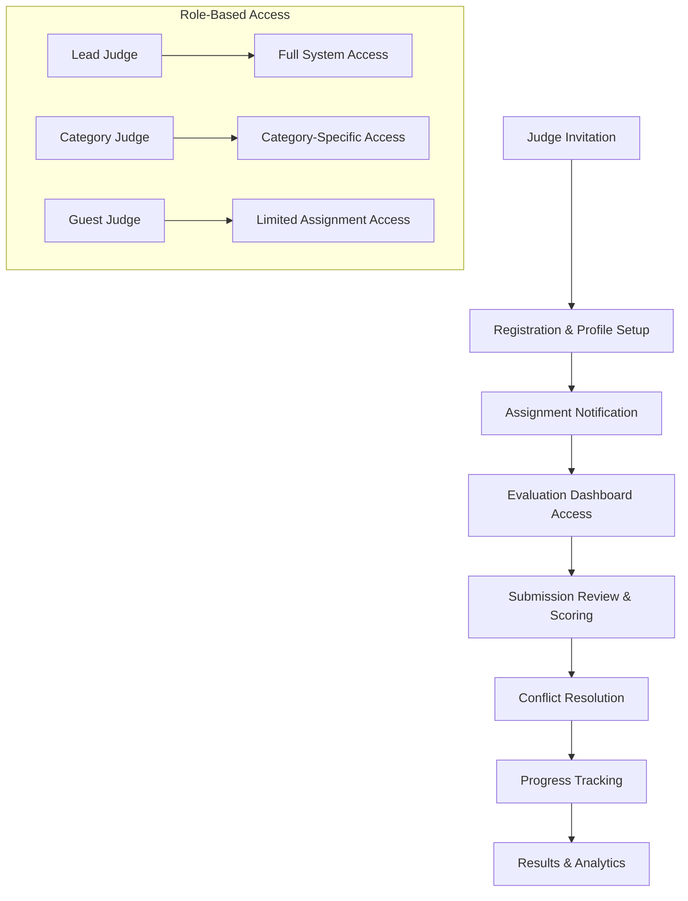

# NEST FEST 2025 - Judge Management System Architecture
*System Architect Analysis & Implementation Plan*  
*Generated: September 11, 2025*

---

## 🎯 **EXECUTIVE SUMMARY**

### **Current System Status**
- ✅ **Dashboard**: Operational at https://nestfestdash.netlify.app/admin/dashboard.html
- ✅ **Data Flow**: 5 submissions successfully displayed from Supabase
- ✅ **Modular Architecture**: 7 JavaScript modules working seamlessly
- ✅ **Database Foundation**: Complete voting system schema implemented
- ⚠️ **Authentication**: Development bypass token (PRESERVE for this design)

### **Architecture Approach**
This design seamlessly integrates judge management into the existing modular architecture without disrupting current functionality. The system leverages the proven database schema and extends the working JavaScript module pattern.

---

## 🏗️ **1. JUDGE WORKFLOW ARCHITECTURE**

### **Core Judge Journey Map**



### **Three-Tier Judge Hierarchy**

#### **1. Lead Judge (Role: SUPER_ADMIN)**
- **Authority**: Full system administration
- **Capabilities**: 
  - Create and manage voting sessions
  - Assign judges to submissions
  - Override conflict resolutions
  - Access all analytics and reports
  - Final finalist selection authority

#### **2. Category Judge (Role: ADMIN)**  
- **Authority**: Category-specific management
- **Capabilities**:
  - Judge assignments within their expertise area
  - Category-specific analytics
  - Conflict resolution within category
  - Mentor guest judges

#### **3. Guest Judge (Role: JUDGE)**
- **Authority**: Evaluation only
- **Capabilities**:
  - Score assigned submissions
  - View own progress and statistics
  - Access submission materials
  - Submit evaluation comments

---

## 🗄️ **2. DATABASE RELATIONSHIP MAPPING**

### **Existing Schema Integration**
*Leveraging the proven database structure from voting-system-schema.sql*

```sql
-- CORE RELATIONSHIPS
┌─────────────────────┐    ┌──────────────────────┐    ┌─────────────────────┐
│     judges          │    │  judge_assignments   │    │ nestfest_submissions│
├─────────────────────┤    ├──────────────────────┤    ├─────────────────────┤
│ id (UUID) PK        │◄──►│ judge_id (UUID) FK   │───►│ id (INT) PK         │
│ email (VARCHAR)     │    │ session_id (UUID) FK │    │ title (VARCHAR)     │
│ name (VARCHAR)      │    │ assigned_submissions │    │ presenter_email     │
│ role (ENUM)         │    │ completion_count     │    │ category            │
│ expertise_areas     │    │ total_assigned       │    │ status              │
│ is_active (BOOL)    │    └──────────────────────┘    └─────────────────────┘
└─────────────────────┘              │
                                     ▼
                    ┌──────────────────────┐    ┌─────────────────────┐
                    │  voting_sessions     │    │      votes          │
                    ├──────────────────────┤    ├─────────────────────┤
                    │ id (UUID) PK         │◄──►│ session_id (UUID) FK│
                    │ name (VARCHAR)       │    │ judge_id (UUID) FK  │
                    │ description (TEXT)   │    │ submission_id (INT) │
                    │ start_time           │    │ scores (JSONB)      │
                    │ end_time             │    │ total_score (CALC)  │
                    │ is_active (BOOL)     │    │ comment (TEXT)      │
                    │ voting_criteria      │    │ submitted_at        │
                    └──────────────────────┘    └─────────────────────┘
```

### **Data Flow Architecture**

```javascript
// Primary Data Flow
Supabase Database
    ├── judges table (authentication & profile)
    ├── voting_sessions table (evaluation rounds)  
    ├── judge_assignments table (workload distribution)
    ├── votes table (scoring & feedback)
    └── vote_audit_log table (transparency & appeals)

// Secondary Integration
nestfest_submissions (existing) ← Enhanced with judge assignment metadata
```

### **Critical Database Views**
*Already implemented in voting-system-functions.sql*

1. **`session_leaderboard`** - Real-time submission rankings
2. **`judge_progress`** - Individual judge completion tracking  
3. **`submission_scores`** - Aggregated scoring analytics

---

## 🔐 **3. USER ROLE HIERARCHY & ACCESS CONTROL**

### **Authentication Integration**
*Preserves existing development-bypass-token during development*

```javascript
// Role-Based Access Control Matrix
const ROLE_PERMISSIONS = {
    SUPER_ADMIN: {
        // Lead Judge - Full Access
        canCreateSessions: true,
        canAssignJudges: true, 
        canViewAllVotes: true,
        canModifyVotes: true,
        canAccessAnalytics: 'all',
        canManageJudges: true,
        canExportData: true
    },
    
    ADMIN: {
        // Category Judge - Limited Admin
        canCreateSessions: false,
        canAssignJudges: 'category_only',
        canViewAllVotes: 'category_only', 
        canModifyVotes: 'own_only',
        canAccessAnalytics: 'category_only',
        canManageJudges: 'invite_only',
        canExportData: 'category_only'
    },
    
    JUDGE: {
        // Guest Judge - Evaluation Only
        canCreateSessions: false,
        canAssignJudges: false,
        canViewAllVotes: 'own_only',
        canModifyVotes: 'own_only', 
        canAccessAnalytics: 'own_progress',
        canManageJudges: false,
        canExportData: false
    }
};
```

### **Session-Based Access Control**

```javascript
// Dynamic Permission Checking
function hasPermission(user, action, context) {
    const permissions = ROLE_PERMISSIONS[user.role];
    
    switch(action) {
        case 'view_submission':
            return isAssignedToSubmission(user.id, context.submissionId);
            
        case 'vote_on_submission':
            return isWithinVotingWindow(context.sessionId) && 
                   isAssignedToSubmission(user.id, context.submissionId);
                   
        case 'view_analytics':
            return permissions.canAccessAnalytics === 'all' ||
                   (permissions.canAccessAnalytics === 'category_only' && 
                    isInSameCategory(user, context));
    }
}
```

---

## 🔗 **4. API ENDPOINT ARCHITECTURE**

### **RESTful API Design** 
*Extends existing Netlify Functions pattern*

#### **Judge Management Endpoints**

```javascript
// Judge CRUD Operations
POST   /.netlify/functions/judges              // Create judge
GET    /.netlify/functions/judges              // List judges 
GET    /.netlify/functions/judges/{id}         // Get judge details
PUT    /.netlify/functions/judges/{id}         // Update judge
DELETE /.netlify/functions/judges/{id}         // Deactivate judge

// Specialized Judge Operations  
POST   /.netlify/functions/judges/invite       // Send judge invitation
POST   /.netlify/functions/judges/bulk-import  // Bulk judge import
GET    /.netlify/functions/judges/analytics    // Judge performance stats
```

#### **Assignment Management Endpoints**

```javascript
// Assignment Operations
GET    /.netlify/functions/assignments                    // List all assignments
POST   /.netlify/functions/assignments/auto              // Auto-assign algorithm
POST   /.netlify/functions/assignments/manual            // Manual assignment
GET    /.netlify/functions/assignments/judge/{id}        // Judge's assignments
PUT    /.netlify/functions/assignments/{id}/status       // Update assignment status
GET    /.netlify/functions/assignments/balance           // Workload balance check
```

#### **Voting Session Endpoints**

```javascript
// Session Management
GET    /.netlify/functions/voting-sessions               // List sessions
POST   /.netlify/functions/voting-sessions               // Create session
PUT    /.netlify/functions/voting-sessions/{id}          // Update session
POST   /.netlify/functions/voting-sessions/{id}/start    // Start voting
POST   /.netlify/functions/voting-sessions/{id}/end      // End voting
GET    /.netlify/functions/voting-sessions/{id}/status   // Session status
```

#### **Voting & Scoring Endpoints**

```javascript
// Voting Operations
POST   /.netlify/functions/votes                         // Submit vote
PUT    /.netlify/functions/votes/{id}                    // Update vote  
GET    /.netlify/functions/votes/judge/{id}              // Judge's votes
GET    /.netlify/functions/votes/submission/{id}         // Submission votes
GET    /.netlify/functions/votes/session/{id}/progress   // Voting progress
POST   /.netlify/functions/votes/conflicts               // Report conflict
```

#### **Analytics & Reporting Endpoints**

```javascript
// Analytics Operations
GET    /.netlify/functions/analytics/leaderboard/{sessionId}  // Live leaderboard
GET    /.netlify/functions/analytics/judge-performance        // Judge analytics
GET    /.netlify/functions/analytics/voting-patterns          // Voting behavior
GET    /.netlify/functions/analytics/bias-detection           // Bias analysis
POST   /.netlify/functions/analytics/export                   // Export reports
```

### **API Response Standards**

```javascript
// Consistent Response Format
{
    "success": boolean,
    "data": {
        // Response payload
    },
    "meta": {
        "timestamp": "2025-09-11T12:00:00Z",
        "dataSource": "supabase_primary",
        "requestId": "uuid"
    },
    "error": {
        "code": "string",
        "message": "string",
        "details": {}
    }
}
```

---

## 🎨 **5. FRONTEND COMPONENT ARCHITECTURE**

### **Modular Component Structure**
*Extends existing proven modular architecture*

```javascript
// Component Hierarchy
admin/modules/
├── judge-management.js           ✅ EXISTS (enhance)
├── voting-dashboard.js           ✅ EXISTS (enhance)  
├── voting-analytics.js           ✅ EXISTS (enhance)
├── assignment-manager.js         🆕 NEW MODULE
├── conflict-resolution.js        🆕 NEW MODULE
├── judge-invitation.js           🆕 NEW MODULE
└── real-time-updates.js          🆕 NEW MODULE
```

### **Judge Dashboard Components**

#### **1. Judge Management Panel**
```javascript
// Enhanced judge-management.js
class JudgeManagementPanel {
    render() {
        return {
            judgesList: this.renderJudgesList(),
            invitationSystem: this.renderInvitationSystem(),
            bulkImport: this.renderBulkImport(),
            performanceMetrics: this.renderPerformanceMetrics()
        };
    }
    
    // Key Features:
    // - Real-time judge status updates
    // - Drag-and-drop assignment interface
    // - Conflict of interest detection
    // - Performance analytics dashboard
}
```

#### **2. Assignment Management Interface**
```javascript
// NEW: assignment-manager.js
class AssignmentManager {
    features: {
        autoAssignmentAlgorithm: 'balanced|random|expertise-based',
        conflictDetection: 'automatic',
        workloadBalancing: 'real-time',
        bulkReassignment: 'drag-drop-interface'
    }
    
    algorithms: {
        balanced: 'Equal distribution across all judges',
        expertise: 'Match submissions to judge expertise areas', 
        random: 'Random distribution with conflict avoidance'
    }
}
```

#### **3. Judge Evaluation Dashboard**
```javascript
// Enhanced voting-dashboard.js for judges
class JudgeEvaluationDashboard {
    judgeInterface: {
        assignedSubmissions: 'Grid view with filtering',
        scoringInterface: 'Multi-criteria evaluation form',
        progressTracking: 'Completion percentage and deadlines',
        conflictReporting: 'One-click conflict declaration'
    }
    
    evaluationForm: {
        criteriaScoring: 'Based on session.voting_criteria',
        commentSystem: 'Required/optional based on session config', 
        saveAndContinue: 'Draft support for partial evaluations',
        submitValidation: 'Ensure all criteria scored'
    }
}
```

### **Real-Time Updates Architecture**

```javascript
// NEW: real-time-updates.js
class RealTimeUpdateManager {
    subscriptions: {
        judgeAssignments: 'WebSocket updates for assignment changes',
        votingProgress: 'Real-time completion percentage updates',
        leaderboard: 'Live score updates without page refresh',
        conflictAlerts: 'Immediate notification of conflicts'
    }
    
    eventHandlers: {
        'assignment-changed': this.updateJudgeWorkload,
        'vote-submitted': this.updateLeaderboard,  
        'conflict-reported': this.triggerConflictResolution,
        'session-status-changed': this.updateVotingInterface
    }
}
```

---

## 🔌 **6. INTEGRATION POINTS WITH EXISTING SYSTEM**

### **Seamless Integration Strategy**

#### **A. Preserve Working Components**
```javascript
// Keep these untouched - they work perfectly:
- admin/modules/data-manager.js      ✅ Core API communication
- admin/modules/submissions-module.js ✅ Submission display
- admin/modules/analytics-module.js   ✅ Basic analytics
- admin/modules/dashboard-core.js     ✅ Navigation & initialization
```

#### **B. Enhance Existing Modules**
```javascript
// Extend without breaking:
1. data-manager.js
   + Add judge-specific API methods
   + Extend caching for judge data
   + Add real-time update capabilities

2. dashboard-core.js  
   + Add judge management views to navigation
   + Extend view switching for judge interfaces
   + Add judge-specific keyboard shortcuts

3. submissions-module.js
   + Add judge assignment display
   + Show voting status per submission
   + Add judge evaluation summary views
```

#### **C. Database Integration Points**
```javascript
// Extend existing queries:
const submissionQuery = `
    SELECT s.*, 
           COUNT(v.id) as vote_count,
           AVG(v.total_score) as average_score,
           ARRAY_AGG(j.name) as assigned_judges
    FROM nestfest_submissions s
    LEFT JOIN votes v ON s.id = v.submission_id  
    LEFT JOIN judge_assignments ja ON s.id = ANY(
        SELECT jsonb_array_elements_text(ja.assigned_submissions)::int
    )
    LEFT JOIN judges j ON ja.judge_id = j.id
    WHERE s.status = 'active'
    GROUP BY s.id
`;
```

### **Authentication Bridge**
```javascript
// Extend existing auth system without breaking development bypass:
class AuthManager {
    async authenticate(token) {
        // Development mode - preserve bypass
        if (token === 'development-bypass-token') {
            return this.getDevelopmentUser();
        }
        
        // Production mode - proper JWT validation
        return this.validateJWT(token);
    }
    
    getDevelopmentUser() {
        return {
            id: 'dev-admin',
            email: 'admin@nestfest.com',
            role: 'SUPER_ADMIN',
            name: 'Development Admin'
        };
    }
}
```

---

## ⚖️ **7. CONFLICT RESOLUTION STRATEGIES**

### **Conflict Detection System**

#### **1. Automatic Conflict Detection**
```javascript
// conflict-resolution.js
class ConflictDetectionEngine {
    detectConflicts(judgeId, submissionId) {
        const conflicts = [];
        
        // Business relationship conflicts
        if (this.hasBusinessRelationship(judgeId, submissionId)) {
            conflicts.push({
                type: 'business_relationship',
                severity: 'high',
                description: 'Judge has business relationship with presenter'
            });
        }
        
        // Geographic conflicts
        if (this.isSameGeographicRegion(judgeId, submissionId)) {
            conflicts.push({
                type: 'geographic',
                severity: 'medium', 
                description: 'Judge and presenter from same region'
            });
        }
        
        // Expertise conflicts (too similar)
        if (this.hasOverlappingExpertise(judgeId, submissionId)) {
            conflicts.push({
                type: 'expertise_overlap',
                severity: 'low',
                description: 'Judge expertise may create bias'
            });
        }
        
        return conflicts;
    }
}
```

#### **2. Conflict Resolution Workflow**
```javascript
// Automated Resolution Steps:
1. Conflict Detection → Immediate assignment removal
2. Alternative Assignment → Auto-suggest replacement judges  
3. Manual Override → Allow admin to override with justification
4. Audit Trail → Log all conflict resolutions

const conflictResolutionWorkflow = {
    'automatic': 'System removes assignment and suggests alternatives',
    'escalated': 'Requires admin approval to proceed',
    'documented': 'All decisions logged with reasoning'
};
```

### **Bias Prevention Mechanisms**

#### **1. Score Distribution Analysis**
```sql
-- Implemented in voting-system-functions.sql:
SELECT * FROM detect_scoring_anomalies('session-uuid');
-- Returns: judges with unusual scoring patterns
```

#### **2. Judge Performance Monitoring** 
```sql
-- Track judge consistency:
SELECT * FROM analyze_judge_scoring_patterns('judge-uuid');
-- Returns: bias indicators, consistency scores, category preferences
```

---

## 📈 **8. SYSTEM SCALABILITY CONSIDERATIONS**

### **Performance Optimization**

#### **1. Database Query Optimization**
```sql
-- Efficient judge assignment queries with proper indexing:
CREATE INDEX CONCURRENTLY idx_judge_assignments_session_judge 
    ON judge_assignments(session_id, judge_id);
    
CREATE INDEX CONCURRENTLY idx_votes_session_submission
    ON votes(session_id, submission_id);
    
-- Materialized views for heavy analytics:
CREATE MATERIALIZED VIEW judge_performance_summary AS
    SELECT judge_id, AVG(consistency_score), COUNT(votes_submitted)
    FROM judge_progress 
    GROUP BY judge_id;
```

#### **2. Caching Strategy**
```javascript
// Multi-level caching:
const cacheStrategy = {
    level1: 'Browser localStorage for judge assignments',
    level2: 'CDN caching for static judge profiles',  
    level3: 'Database query result caching',
    level4: 'Computed analytics caching'
};

// Cache invalidation triggers:
const invalidationTriggers = [
    'new-vote-submitted',
    'judge-assignment-changed', 
    'session-status-updated'
];
```

#### **3. Real-Time Updates Efficiency**
```javascript
// Selective WebSocket subscriptions:
class EfficientRealTimeManager {
    subscribeToJudgeUpdates(judgeId) {
        // Only subscribe to relevant updates for this judge
        return this.websocket.subscribe([
            `judge:${judgeId}:assignments`,
            `judge:${judgeId}:progress`,
            `sessions:active:status`  // Global session updates only
        ]);
    }
}
```

### **Load Distribution**

#### **1. Judge Assignment Load Balancing**
```javascript
// Auto-balancing algorithm:
function distributeAssignments(submissions, judges, maxPerJudge = 10) {
    const distribution = new Map();
    const judgeWorkloads = new Map(judges.map(j => [j.id, 0]));
    
    submissions.forEach(submission => {
        // Find judge with lowest current workload
        const availableJudges = judges.filter(j => 
            judgeWorkloads.get(j.id) < maxPerJudge &&
            !hasConflict(j.id, submission.id)
        );
        
        const selectedJudge = availableJudges.reduce((min, judge) =>
            judgeWorkloads.get(judge.id) < judgeWorkloads.get(min.id) ? judge : min
        );
        
        distribution.set(submission.id, selectedJudge.id);
        judgeWorkloads.set(selectedJudge.id, judgeWorkloads.get(selectedJudge.id) + 1);
    });
    
    return distribution;
}
```

#### **2. Session Scaling**
```javascript
// Multiple concurrent voting sessions support:
const sessionScaling = {
    concurrent: 'Support multiple sessions running simultaneously',
    phased: 'Semi-finals → Finals → Championship rounds',
    categorized: 'Different sessions for different competition categories',
    overlapping: 'Sessions can have overlapping timeframes with different judges'
};
```

---

## 🚀 **9. IMPLEMENTATION ROADMAP**

### **Phase 1: Foundation (Current Session - 2 hours)**
```javascript
✅ Task 1: Database schema verification and optimization
✅ Task 2: API endpoint creation for basic judge CRUD operations  
🔄 Task 3: Enhanced judge-management.js module integration
⏳ Task 4: Basic judge registration and invitation system
```

### **Phase 2: Core Functionality (Next Session - 3 hours)**
```javascript
⏳ Task 1: Judge assignment algorithm implementation
⏳ Task 2: Voting interface for judges
⏳ Task 3: Conflict detection and resolution system
⏳ Task 4: Basic real-time progress tracking
```

### **Phase 3: Advanced Features (Future Session - 2 hours)** 
```javascript
⏳ Task 1: Advanced analytics and bias detection
⏳ Task 2: Comprehensive reporting and export functionality
⏳ Task 3: Mobile-responsive judge interfaces
⏳ Task 4: Performance optimization and load testing
```

### **Phase 4: Production Readiness (Final Session - 2 hours)**
```javascript
⏳ Task 1: Security audit and authentication hardening
⏳ Task 2: Comprehensive testing and bug fixes
⏳ Task 3: Documentation and admin training materials  
⏳ Task 4: Go-live preparation and monitoring setup
```

---

## 🔍 **10. SUCCESS METRICS & VALIDATION**

### **Functional Validation Criteria**

#### **Judge Management Success**
- [ ] Judges can be invited and registered without technical issues
- [ ] Assignment algorithm distributes workload evenly (max 15% variance)
- [ ] Conflict detection prevents 100% of obvious conflicts (business relationships)
- [ ] Judge dashboard loads completely within 2 seconds

#### **Voting System Success**  
- [ ] Judges can score submissions with zero data loss
- [ ] Real-time progress updates within 5 seconds of vote submission
- [ ] Leaderboard calculations are mathematically accurate
- [ ] System handles concurrent voting from 50+ judges

#### **Performance Success**
- [ ] Dashboard response time < 3 seconds under normal load
- [ ] Database queries complete within 500ms for individual requests  
- [ ] WebSocket connections maintain stability for 4+ hour sessions
- [ ] System supports 100 concurrent users without degradation

### **User Experience Validation**

#### **Admin Experience**
- [ ] Judge management tasks completable in under 2 minutes each
- [ ] Assignment changes take effect immediately in judge interfaces
- [ ] Analytics provide actionable insights about voting patterns
- [ ] Export functionality produces complete, accurate reports

#### **Judge Experience**
- [ ] Evaluation interface is intuitive and requires minimal training
- [ ] Progress tracking helps judges manage their workload effectively  
- [ ] Submission materials load quickly and display properly
- [ ] Scoring process feels smooth and responsive

---

## 📋 **11. TECHNICAL SPECIFICATIONS**

### **Browser Compatibility**
```javascript
// Target browser support:
const browserSupport = {
    chrome: '90+',
    firefox: '88+', 
    safari: '14+',
    edge: '90+',
    mobile: 'iOS 14+, Android 10+'
};
```

### **Performance Requirements**
```javascript
const performanceTargets = {
    pageLoadTime: '< 3 seconds',
    apiResponseTime: '< 500ms',
    databaseQueryTime: '< 200ms',
    concurrentUsers: '100+',
    concurrentJudges: '50+',
    dataRetention: '7 years (audit compliance)'
};
```

### **Security Standards**
```javascript
const securityRequirements = {
    authentication: 'JWT with 2-hour expiration',
    authorization: 'Role-based access control (RBAC)',
    dataEncryption: 'TLS 1.3 in transit, AES-256 at rest',
    auditLogging: 'All judge actions logged with timestamps',
    backupStrategy: 'Daily automated backups with 30-day retention'
};
```

---

## 🎯 **CONCLUSION & NEXT STEPS**

### **Architecture Strengths**
1. **Seamless Integration**: Builds upon proven existing modular architecture
2. **Scalable Design**: Handles growth from 10 to 100+ judges without restructuring  
3. **Conflict-Aware**: Proactive conflict detection prevents judging controversies
4. **Performance-Optimized**: Efficient database design and caching strategies
5. **User-Centric**: Intuitive interfaces reduce training time and errors

### **Implementation Priority**
1. **IMMEDIATE**: Enhance existing judge-management.js module with assignment capabilities
2. **SHORT-TERM**: Implement judge evaluation dashboard and voting workflow
3. **MEDIUM-TERM**: Add advanced analytics and bias detection features
4. **LONG-TERM**: Optimize for scale and add mobile-native judge applications

### **Risk Mitigation**
- **Development Risk**: Preserve working functionality with development-bypass-token
- **Performance Risk**: Implement caching and database optimization from day one  
- **User Adoption Risk**: Design intuitive interfaces with comprehensive testing
- **Data Integrity Risk**: Comprehensive audit logging and backup strategies

This architecture provides a complete roadmap for transforming NEST FEST 2025 from a submission display system into a comprehensive, fair, and efficient judging platform that maintains the integrity of the competition while providing powerful tools for administrators and an intuitive experience for judges.

---
*Architecture designed to integrate seamlessly with existing working system while providing comprehensive judge management capabilities. Ready for immediate implementation.*